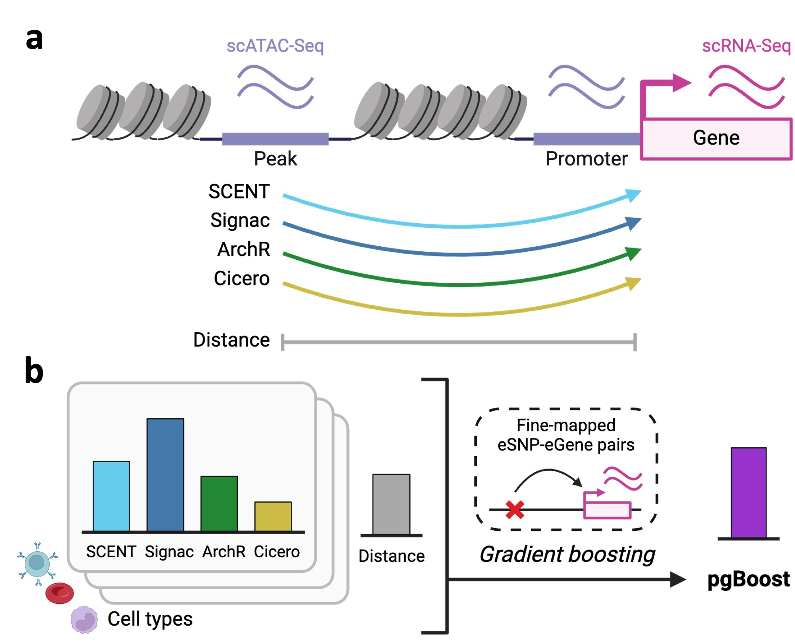

# pgBoost

Gradient-boosting framework for linking regulatory variants to target genes using single-cell multiome data and genomic distance.

[](https://www.nature.com/articles/s41588-025-02220-3)

[](https://doi.org/10.5281/zenodo.15276307)

pgBoost performs SNP-gene linking by integrating peak-gene scores from multiple single-cell multiome methods with genomic distance in a gradient boosting framework trained on fine-mapped eQTL data. pgBoost achieves stronger enrichment for validated regulatory links than existing approaches, especially for distal links.

The pgBoost framework requires single-cell multiome (RNA-seq + ATAC-seq) data as input, and generates probabilistic scores for candidate SNP-gene links as output. See below for the steps to generate pgBoost features from single-cell multiome data and run pgBoost.

<div align="center">

</div>

## Installation

The required R packages are listed in `DEPENDENCIES.txt`. A conda environment file is also provided:

```bash
conda env create -f environment.yml
conda activate pgboost
```

## Step 1: Generate constituent scores

Tutorial code to generate linking scores from constituent methods has been provided [here](https://github.com/elizabethdorans/E2G_Method_Tutorials/). To run pgBoost, scores must be generated for [Signac](https://github.com/elizabethdorans/E2G_Method_Tutorials/tree/main/Signac), [SCENT](https://github.com/elizabethdorans/E2G_Method_Tutorials/tree/main/SCENT), and [Cicero](https://github.com/elizabethdorans/E2G_Method_Tutorials/tree/main/Cicero).

<ins>NOTE</ins>:
- When running SCENT, follow all instructions marked \*** to skip the p-value calculation (not needed for pgBoost input). This will save time and computational resources.
- _Do not_ perform the optional "post-processing for IGVF portal" step for any of the constituent score files.

## Step 2: Create pgBoost input files

After constituent scores have been generated, `notebooks/01_generate_pgboost_features.ipynb` can be used to generate pgBoost input files. This notebook will generate distance-based features and output the `--data_file`, `--predictor_file`, and `--drop_duplicates_file` inputs needed for the pgBoost script.

## Step 3: Run pgBoost

pgBoost takes as input a data set of candidate SNP-gene regulatory links x link attributes (peak-gene correlation-based scores from constituent linking methods, distance-based features) and generates consensus linking scores using gradient boosting in a leave-one-chromosome-out framework.

```bash
Rscript pgBoost.R \
  --data_file data.tsv \
  --training_file resources/training_data.tsv.gz \
  --predictor_file predictors.txt \
  --drop_duplicates_file drop_duplicates.txt \
  --outfile pgboost_predictions.tsv
```

Example input and output files are provided in `examples/`.

## Example

A small example run is provided so the input and output formats can be checked quickly:

```bash
Rscript pgBoost.R \
  --data_file examples/input/data.tsv \
  --training_file resources/training_data.tsv.gz \
  --predictor_file examples/input/predictors.txt \
  --drop_duplicates_file examples/input/drop_duplicates.txt \
  --outfile examples/output/pgboost_predictions.tsv
```

The example files are intentionally small and are not intended to reproduce the full paper-scale analysis.

## Arguments

| Argument | Description |
| -------- | ----------- |
| `--data_file` | A tab-separated data frame of candidate links (rows) x linking attributes (columns). Must contain all columns specified in `--predictor_file` and the column specified in `--LOO_colname`. Must also contain one or more columns which uniquely index candidate links (e.g. `snp`, `peak`, `gene`). Additional columns will be ignored. |
| `--training_file` | A tab-separated data frame of training links (rows) x training link attributes (columns). Must contain one column named `positive` which provides a binary indicator (0/1) of whether a link is a positive (1) or negative (0) training instance. Must contain columns which uniquely identify candidate links (e.g. `snp`, `peak`, `gene`) matching those in `--data_file`. The pgBoost training set has been provided at `resources/training_data.tsv.gz`. |
| `--predictor_file` | A line-delimited text file containing names of columns to use as predictors. Must match columns in `--data_file`. |
| `--drop_duplicates_file` | Optional line-delimited text file containing the names of columns used to drop duplicate instances during training. If more than one training instance contains the same values across these columns and the same classification as positive/negative, only one instance will be retained. |
| `--LOO_colname` | Name of the column used to group links for the leave-one-out framework, e.g. `chr`, `CHR`, `chrom`, `chromosome`. Default is `chr`. |
| `--outfile` | Name of tab-delimited file where pgBoost predictions will be saved. Default is `pgboost_predictions.tsv`. |
| `--seed` | Value to pass to `set.seed()`. Default is `511`. |
| `--nthread` | Number of threads to use for xgboost. Default is `1`. |

## Output

The pgBoost output file will include:

- All index columns uniquely identifying candidate links (e.g. `snp`, `peak`, `gene`).
- `pgBoost_probability`: pgBoost predictions (probabilities generated by the gradient boosting classification algorithm).
- `pgBoost_percentile`: percentile rank by `pgBoost_probability` (we recommend a threshold of `pgBoost_percentile > 0.95` to define true links; see [Dorans et al. Nature Genetics 2025](https://www.nature.com/articles/s41588-025-02220-3)).

An example output file is provided at `examples/output/pgboost_predictions.tsv`.
